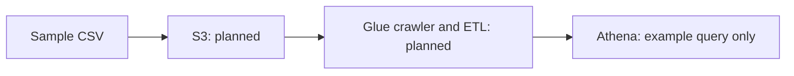

# AWS Data Engineering Learning Labs

This is a consolidated learning repository and pipeline scaffold, not a completed end-to-end AWS pipeline.

## What is present

- A small sample CSV in `dataset/sample.csv`.
- One Athena example, `SELECT * FROM sales_data`, in `athena/queries.sql`.
- Brief crawler and architecture notes, plus AWS service learning notes under `labs/`.

## Intended architecture

## How to inspect

Read `dataset/sample.csv`, `athena/queries.sql`, and the consolidated labs below. The Athena query requires a separately configured `sales_data` table. There is no automated setup or runnable pipeline command yet.

## Missing before describing this as a completed project

Glue transformation code, reproducible infrastructure/configuration, data-quality assertions, partitioned output, and a recorded successful run. No measured scale or cost reduction is established.

## Consolidated notes

- [aws-end-to-end-data-engineering-project](labs/aws-end-to-end-data-engineering-project/README.md)
- [aws-data-engineering](labs/aws-data-engineering/README.md)
- [aws-data-engineering-pipeline](labs/aws-data-engineering-pipeline/README.md)
- [aws-medallion-data-pipeline](labs/aws-medallion-data-pipeline/README.md)

Original repositories and history remain available. No cloud deployment or execution is implied by this consolidation.
