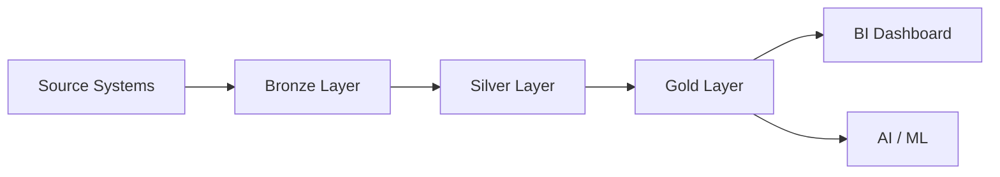

# ☁️ AWS Medallion Data Pipeline

> **Enterprise Data Engineering Project** implementing a scalable **Bronze → Silver → Gold** Lakehouse architecture on AWS for modern analytics workloads.


---

## 📖 Executive Summary

Modern organizations receive data from multiple operational systems every day. This project demonstrates how those raw datasets can be transformed into trusted, analytics-ready assets using the **Medallion Architecture**.

The pipeline follows an enterprise workflow where raw data is ingested into Bronze, cleaned in Silver, and modeled into Gold for business intelligence and AI applications.

---

# 🏛️ Solution Architecture



### Architecture Layers

| Layer     | Purpose                           |
| --------- | --------------------------------- |
| 🥉 Bronze | Raw ingestion from source systems |
| 🥈 Silver | Data cleansing & standardization  |
| 🥇 Gold   | Business-ready analytical models  |

---

# ⚡ Tech Stack

| Category     | Technology             |
| ------------ | ---------------------- |
| Cloud        | AWS                    |
| Storage      | Data Lake              |
| Processing   | SQL                    |
| Architecture | Medallion              |
| Modeling     | Bronze • Silver • Gold |
| Analytics    | BI Ready               |

---

# 📂 Repository Structure

```text
aws-medallion-data-pipeline/
│
├── architecture/      # System architecture diagrams
├── dataset/           # Raw & sample datasets
├── docs/              # Technical documentation
├── screenshots/       # Pipeline screenshots
├── sql/               # SQL transformations
└── README.md
```

---

# 🔄 End-to-End Pipeline

```text
Raw Files
    │
    ▼
Bronze Layer
(Data Ingestion)
    │
    ▼
Silver Layer
(Data Quality & Cleaning)
    │
    ▼
Gold Layer
(Business Models)
    │
    ▼
Power BI / AI
```

---

# ✨ Engineering Highlights

* Multi-layer Lakehouse design
* Incremental data processing
* Business-focused SQL transformations
* Analytics-ready Gold datasets
* Enterprise folder organization
* Cloud-first architecture approach

---

# 📊 Business Use Case

Imagine an FMCG company collecting sales, customer, and product data from different regions.

This pipeline transforms fragmented operational data into:

* Clean customer dimension
* Product master data
* Standardized sales facts
* Business KPI datasets
* Reporting-ready analytical tables

---

# 🎯 Learning Outcomes

* Medallion Architecture
* Enterprise Data Modeling
* AWS Data Lake concepts
* SQL Transformation Pipeline
* Bronze → Silver → Gold workflow
* Analytics Engineering fundamentals

---

# 👨‍💻 Author

**Syed Saud Alam**

*Data Engineer • AWS • Lakehouse Architecture • SQL*
